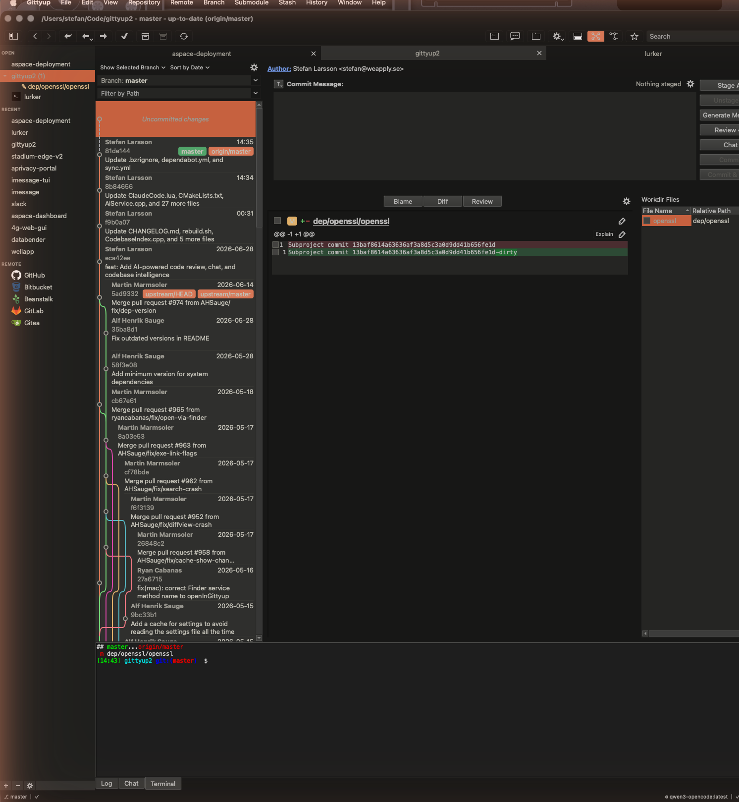
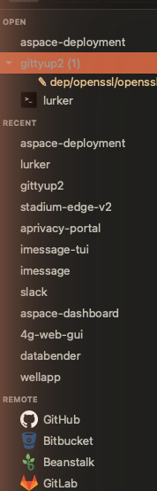

Changelog
=========

TL;DR
-----

This fork adds a full AI-powered development assistant to Gittyup: code review
with intelligent caching, commit message generation, per-hunk explanations, an
interactive chat panel, codebase-aware context injection (RAG), background repo
analysis, pattern-matching auto-fix recipes, and SSH repository cloning. Backed
by [Ollama](https://ollama.com) (local/LAN) or Anthropic Claude API.

It also ships a built-in **terminal emulator** (libvterm + custom Qt renderer),
a **merged repo/changes sidebar**, a live **status bar**, a model-routing **task
dispatcher**, and a bundled **Claude Code** theme.

A follow-up pass (the "AI engine" waves below) made the assistant **faster**
(batched embeddings, parallel indexing), **more robust** (request timeouts,
retry with backoff, cancellation, bounded queue), **smarter** (full changed-file
review context, normalized embeddings, indexed similarity), and added **streaming
code reviews with a Stop button**, with chat unified onto the same task pipeline.

Unreleased
----------

### AI Engine Improvements

Performance, robustness and quality work across the AI subsystem:

- **Faster embeddings** — `EmbeddingClient` batches inputs through Ollama's
  `/api/embed` endpoint (one request per group, capped concurrency) instead of
  one HTTP request per item, with a transparent fallback to `/api/embeddings`.
- **Faster indexing** — `CodebaseIndex` hashes file contents directly instead of
  spawning a `git hash-object` process per file, and embeds chunks in batched
  windows.
- **Request timeouts** everywhere (`AiRequestTimeoutSeconds`, default 300s) so a
  stalled server can no longer hang a request forever.
- **Cancellation** — `TaskDispatcher` hands out task handles; `cancel()` aborts a
  queued or in-flight request. Timeouts and user-cancels are distinguished so a
  cancel isn't counted as a failure.
- **Retry with backoff** on transient failures (timeout, connection refused,
  5xx, 429), up to `AiMaxRetries`. **Bounded queue** rejects work past a cap
  instead of growing unbounded.
- **Streaming code reviews** — reviews render progressively with a **Stop**
  button (gated by `AiStreamReviews`); a cancel shows "Review cancelled."
- **Smarter review context** — the full working-tree content of changed files is
  attached to the review prompt (budgeted), removing a class of false positives
  where issues were already handled just outside the hunk. RAG retrieval now
  queries on the changed hunks rather than the raw diff prefix.
- **Embedding correctness** — vectors are normalized at write time and the
  knowledge base / codebase index gained `embedding_model` indexes for faster
  per-model similarity search.
- **Live cache stats** — knowledge-base cache hits show as "⚡ N cached" in the
  status bar.
- **Git off the UI thread** — `RepoAnalyzer` and the chat repo-context builder
  use libgit2 instead of synchronous `git` subprocesses that blocked the UI.
- **Unified chat** — `ChatPanel` sends through `TaskDispatcher` (multi-turn
  message array), inheriting shared timeouts/retry/cancellation/stats and
  dropping its duplicated stream-parsing code.

### AI Code Review

- Review staged or unstaged diffs via the **Review Code** button. Findings are
  displayed with severity indicators (CRITICAL / HIGH / MEDIUM / LOW), file
  references, and suggested fixes.
- Right-click any commit in the history list to review that specific diff.
- 3-step caching pipeline to avoid redundant API calls:
  1. Exact diff hash lookup (~0 ms)
  2. Semantic similarity search via embeddings (~100 ms)
  3. Full LLM review — only when no cache match is found
- Browse all past reviews for a repository via **Review History**.

### Commit Message Generation

- **Generate Message** button sends the current diff to the LLM and populates
  the commit message field using conventional commits format.

### Per-Hunk Explanations

- **Explain** button on each diff hunk header. The LLM response is rendered
  inline below the diff with basic markdown formatting.

### Chat Panel

- Interactive chat sidebar docked in the repo view. Toggle with
  `Ctrl+Shift+C`, the **Chat** button, or the View menu.

### Knowledge Base

- SQLite-backed local cache (`knowledge.db`) stores structured review findings
  with categories, severities, code patterns, fix templates, and embedding
  vectors. WAL mode enabled for crash safety.
- Finding parser extracts structured data from AI responses (category, severity,
  file, line, language, code pattern, fix suggestion). Falls back to heuristic
  parsing when the model doesn't follow the structured format.
- Embedding client calls Ollama `/api/embeddings` (default model:
  `nomic-embed-text`) for vector computation. Cosine similarity search via a
  header-only vector math implementation with no external dependencies.
- Cache hit rate tracking with statistics in Settings.

### Codebase RAG Index

- Scans all tracked repositories, collects source files (30+ extensions),
  chunks them into ~50-line overlapping segments, embeds each chunk, and stores
  vectors in a separate SQLite database (`codebase_index.db`).
- When a review is triggered, the top-5 most similar chunks are injected as
  context in the LLM prompt for deeper codebase understanding.
- Incremental indexing — only changed files (by git blob SHA) are re-indexed.
- Settings UI with **Index All Repos Now**, **Clear Index**, and live stats.

### Background Repo Analysis

- Continuously monitors recently-opened repositories for HEAD changes and
  automatically runs deep analysis with structured findings and FIND/REPLACE
  fix sections.
- Configurable interval (5–60 minutes) and enable/disable toggle in Settings.

### Fix Recipes

- Pattern-matching auto-fix without LLM calls. FIND/REPLACE pairs with file
  glob patterns are extracted from review responses and stored in the knowledge
  base. Known patterns can be applied directly on future diffs.

### SSH Repository Access

- **Open SSH Repository** action in the sidebar. Dialog with SSH URL input,
  connection testing, key selection, and background cloning.
- SSH repos displayed with a terminal icon to distinguish them from local
  repositories.

### Settings — AI Panel

- Full configuration panel in Preferences:
  - Provider selection (Anthropic Claude / Ollama)
  - API key, server URL, and model fields per provider
  - Knowledge Base controls (enable, similarity threshold, embedding model,
    stats, clear)
  - Continuous Analysis controls (enable, interval, analyze now, progress)
  - Codebase Index controls (stats, index now, clear)
  - Scrollable layout to accommodate all sections

### UI Integration

- **Generate Message**, **Review Code**, **Review History**, and **Chat**
  buttons added to the commit editor toolbar.
- View menu toggle **Show/Hide Chat** with `Ctrl+Shift+C` shortcut.
- Repo view splitter updated from 2-pane to 3-pane (detail + chat + log)
  with animated show/hide transitions.

### Integrated Terminal

- Built-in terminal emulator backed by [libvterm](https://www.leonerd.org.uk/code/libvterm/)
  (MIT, the VT engine used by Neovim) with a custom `QAbstractScrollArea` +
  `QPainter` cell renderer. No external terminal process or licensing conflicts.
- Full ANSI rendering: 256-color and true-color, bold/italic/underline
  (single/double/curly)/strikethrough/reverse, and cursor with blink.
- PTY-backed shell via `forkpty` (`$SHELL`, `TERM=xterm-256color`); spawns in the
  active repository's working directory.
- Scrollback buffer (5000 lines) wired to the scroll bar, live resize
  (`vterm_set_size` + `TIOCSWINSZ`), and UTF-8 / IME input.
- **Tab completion works** — Tab/Shift+Tab are routed straight to the shell
  instead of being consumed by Qt focus navigation, and application
  single-key shortcuts (e.g. the diff view's `d`/`w`) no longer steal keystrokes
  while the terminal has focus (handled via `ShortcutOverride`). Command-key
  shortcuts still reach the app.
- Toggle from **View → Show Terminal** (Ctrl + `` ` ``), as a tab in the bottom
  panel alongside Log and Chat.

### Merged Repo / Changes Sidebar

- The separate **CHANGES** section was merged into **OPEN**: each open
  repository now lists its changed files as expandable children, with a change
  count next to the repo name and a per-file status indicator (modified / added
  / deleted) using colored text and icons.
- Repositories with changes auto-expand; expansion state is restored across
  sessions.
- SSH repositories are shown with a distinct terminal-style icon.

### Status Bar

- New bottom status bar showing branch, upstream tracking, repository state, and
  dirty/clean status.
- AI status: active model name, Ollama/GPU availability (polled), and the
  current task queue depth and token counters.

### Task Dispatcher

- Central `TaskDispatcher` (in `src/ai/`) that queues AI work by type
  (Review / Chat / Embedding / CommitMsg) and priority
  (Low / Normal / High / Critical).
- Per-model routing with GPU preference and max-concurrency limits, plus
  aggregate stats (queued/active/completed/failed, tokens in/out, cache hits)
  surfaced in the status bar.

### Theme

- Bundled **Claude Code** theme (`conf/themes/ClaudeCode.lua`), a dark theme
  with colors extracted from the Claude Desktop palette.

### UI Polish

- The **Uncommitted changes** row in the commit list is now rendered at half
  height to reduce vertical noise.

### Build System

- Added `Sql` to `QT_MODULES` in root CMakeLists for SQLite support.
- New `src/ai/` library (links to `conf`, `Qt6::Core`, `Qt6::Network`,
  `Qt6::Sql`); includes `AiService`, `KnowledgeBase`, `CodebaseIndex`,
  `EmbeddingClient`, `FindingParser`, and `TaskDispatcher`.
- Bundled [libvterm](https://github.com/neovim/libvterm) as a static dependency
  under `dep/libvterm/` (built via CMake, linked into the `ui` library).
- New UI sources: `ChatPanel`, `CodeReviewDialog`, `SpinnerButton`,
  `SshDialog`, `TerminalPanel`, `StatusBar`.
